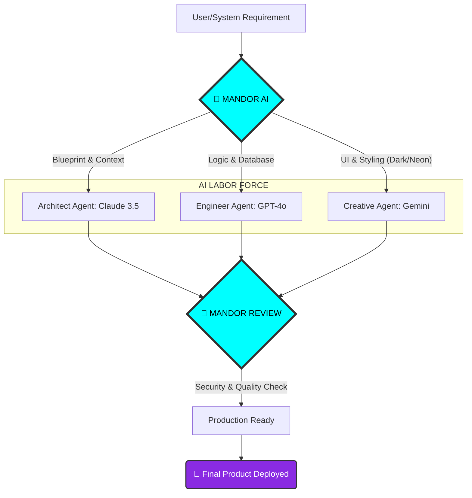

<h1 align="center">🏗️ [Adinda.exe] | THE AI ORCHESTRATOR (MANDOR AI)</h1>

<p align="center">
  <a href="https://git.io/typing-svg">
    
  </a>
</p>

---

## 🚦 Operational Status: **ACTIVE**
> *"Tugas saya bukan lagi mengetik baris kode dari nol, tapi memimpin pasukan kecerdasan buatan untuk membangun sistem yang sempurna dalam waktu singkat."* — **Adinda Ardiansyah**

---

## 🛠️ Alur Kerja Mandor (Orchestration Flow)



<br/>

## 🎛️ `orchestrator_config.json`

```json
{
  "commander": {
    "name": "Adinda Ardiansyah",
    "base_operation": "South Tangerang, ID",
    "background": "Computer & Network Engineering"
  },
  "active_directives": {
    "Stynxveil": "Brand & Web Development Ecosystem",
    "Boston Point": "Community Platform Architecture",
    "FrozBite": "E-Commerce Integration"
  },
  "core_competencies": [
    "AI Prompt Orchestration",
    "Modern UI/UX Architecture",
    "System & Network Logic"
  ]
}
```

<br/>

## 🔋 Arsenal & Tools

<p align="left">
  
  
  
  
  
  
  
  
</p>

<br/>

## 📡 System Telemetry

<div align="center">
  
  <br/>
  
</div>

<br/>

## 🔗 [ INIT CONTACT SEQUENCE ]

<p align="left">
  <a href="mailto:YOUR_EMAIL@gmail.com"></a>
  <a href="https://linkedin.com/in/YOUR_LINKEDIN"></a>
</p>
